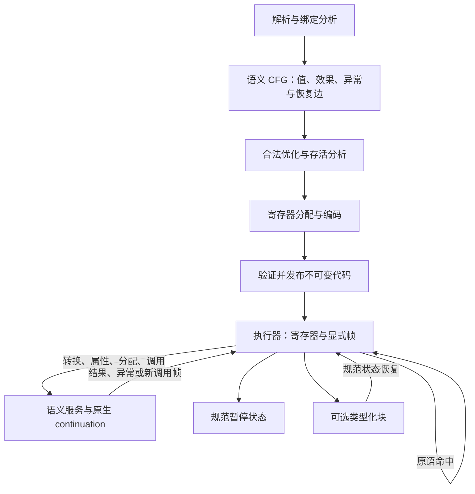

# 原语 VM：目标架构、代码结构与算法设计

状态：架构提案，未实施，未测得新实现收益。2026-09-12。

**交付约束：在一个 PR 内完成目标架构、生产迁移、旧路径退出和本轮问题验收。** 见[逐 commit 计划](primitive-vm-commit-plan.md)；阶段切片用于实现与审查，不能替代最终合并门槛。

后续实施见[细化实施计划](primitive-vm-implementation-plan.md)：模块依赖、状态与根协议、编译/执行算法、P0–P9 交付顺序和维护性验收。该文将本提案收敛为可领取的实施任务。

**双重目标：完成更合理、可维护的目标 VM 架构，并解决 issue #16 中本轮覆盖的具体问题。** 架构改进本身可以成为必做项；阶段性收益不能替代架构完成，架构完成也不能替代问题解决。本轮聚焦清单第 1、5、7、9、10 项：栈深、数值流程、调用成本、局部更新与 PC/帧管理；其中 PC 成本先独立归因。直接槽执行、显式调用帧、清晰的值与根管理、统一异常/恢复协议、数据流与发布验证、可维护模块边界是必做能力；寄存器/优化栈、值布局、GC 算法、帧存储等具体选择通过实验定稿。完整能力清单、问题映射和双重验收见[实施计划](primitive-vm-implementation-plan.md)。

**设计前提：当前架构不作为保留目标。** 栈字节码、逐 local/argument 的 VmHost 协议、owning Value、分散的帧存储、每值引用计数以及 Rust 递归驱动普通 JS 调用，都允许替换。保留的是 ECMAScript 可观察行为、明确的宿主接口契约和可核验的性能证据。迁移顺序服务于目标架构，不反过来决定目标。

基线为 PR #19 的 `c52d4dc7747641756dff8cb7159b9885e9cc8b17`，生产 Rust 源码与 `1cc51bb5fcc5c36912d3197d877219ae513dc4b5` 一致；#19 尚未合并，不能把该基线称为 upstream 默认分支现状。现有源码用于行为参照、差分执行和成本定位，不要求新执行器沿用其接口或内部表示。

关联：[#16 完整性能更新](https://github.com/pocket-stack/quickjs-oxide/issues/16#issuecomment-5634660983)、[Tachyon 架构研究](https://github.com/pocket-stack/quickjs-oxide/issues/16#issuecomment-5637832222)、[#20 统一可恢复执行](https://github.com/pocket-stack/quickjs-oxide/issues/20)。本文细化原语执行、编译器、值/帧和调用边界；完整 Fiber 调度与取消政策仍由 #20 单独定义。

## 1. 从数据提出架构问题

待解决问题以 issue #16 为准：执行分派/数值路径、值与引用搬运，以及调用状态组织。本文只描述设计与验收要求，不附历史测量结果，也不宣称本 PR 已取得优化收益。

现有实现的主要结构事实：

- [frame_execution.rs](../src/engine/vm/frame_execution.rs) 在每条指令前通过 host 发布 PC，随后分派。常见局部操作已经进入主循环，不是尚未内联的旧版本。
- [host_bridge.rs](../src/engine/vm/host_bridge.rs) 拥有 arguments/locals，而 [activation.rs](../src/engine/vm/activation.rs) 另有 operand stack；普通调用仍经 Rust 调用层进入新的 VM。
- [Value](../src/engine/value/mod.rs) 非 Copy；部分值的复制/释放进入 runtime 生命周期处理。纯数值输入写入原来持有 Object 的目标槽也可能触发释放。
- [发布验证](../src/engine/code/bytecode.rs) 已认证栈、控制流和异常区域；[VerifiedFunction](../src/engine/code/bytecode_publish/verified.rs) 已拥有经过验证的草稿。
- primitive ToPrimitive 绕过、Number 更新、静态分支证明、pop_pair 检查合并等已存在。新架构不能重复把这些已有优化计作收益。

要验证的假设是：让计算直接作用于 VM 拥有的执行槽，减少重复表示与跨层协议，比继续逐个缩短 helper 更有收益。

## 2. 三条真正不同的架构路线

### S：重新设计的显式栈 VM

一个 VM frame 统一拥有参数、局部变量与操作数区；解释器把栈顶一至两个值和 PC 缓存在局部变量。调用在显式 VM frame stack 上推进；在效果/观察边界回写。编译器生成紧凑栈码，并只为实测常见序列提供少量 superinstruction。

```rust
fn run_stack(execution: &mut StackExecution, code: &VerifiedStackCode)
    -> ExecutionBoundary;
```

调用者提交一个执行，内部隐藏栈顶缓存、spill、分派和帧切换。基本块入口约定规范栈状态，不能让同一入口依赖某条前驱留下的不同缓存布局。

优点是代码紧凑、编译与解码可以简单；栈顶缓存能减少栈读写，显式调用帧同样支持未来暂停恢复。代价是栈重排、重复 load、效果边界 spill；融合 opcode 扩展过多会增加 .text 和分派复杂性。

这是认真参与比较的候选。不能拿寄存器 VM 与目前经过 VmHost 的旧栈 VM 比一次，就宣称寄存器架构必然更好。

### R：通用值寄存器 VM

指令直接命名输入和输出，已证明非逃逸的局部变量直接占用寄存器槽，临时值经存活分析分配。每个 baseline opcode 有完整 JS 语义；常见标签在执行循环内完成，需要转换/调用时进入效果边界。

```rust
fn run_registers(execution: &mut Execution, code: &VerifiedRegisterCode)
    -> ExecutionBoundary;
// 例如 Add dst, lhs, rhs；BranchFalse cond, target。
```

调用者不接触逐值 host 协议。寄存器是 VM 数组中的槽，不是 CPU 物理寄存器。该形状消除许多 stack shuffle/load 指令，并为调试、root 枚举、挂起和后续专化提供规范状态。

代价是更宽的操作数、更大的字节码和分配/并行 move 工作；实际收益取决于解码、缓存和寄存器数量。

### T：类型化执行块与自适应专化

编译器生成带类型、guard 和退出状态映射的块；执行器针对一段计算共享标签检查和临时状态。类型不符合时转入通用语义，或重建一个规范 baseline 状态。

```rust
fn run_specialized(plan: &PinnedPlan, execution: &mut Execution)
    -> SpecializedExit;
```

调用者只选择块版本、接收出口；复杂性集中在类型假设、失效、state map、构建成本和代码体积。其机会是跨操作消除标签检查、分派与通用值物化；其风险是又增加一层微操作解释器，若没有真实融合反而更慢。

直接以 T 作为唯一表示，会令异常、调试、挂起和类型变化过度依赖恢复机制。因此优先把它作为可选层，而非完整引擎能够正确执行的前提。

### 比较与推荐

S 的接口隐藏栈缓存，最适合紧凑代码与低编译成本。R 的接口隐藏寄存器分配，显式数据流和规范状态更利于普通计算、调用与可恢复执行共用一个核心。T 隐藏一整段专化计算，单次入口最简单，但构建与恢复的证明负担最大。

**主候选为 R：寄存器 baseline + 显式调用帧 + VM 管理的执行值/roots；T 是证据支持后增加的优化层，S 是同底座的竞争方案。** 这个选择首先基于状态与数据流组织，而不是尚未存在的跑分。若 S 在相同值、GC、调用和语义底座上更好，应允许改变选择。

## 3. 从 Tachyon 学什么

固定参考 `2d148e462233c884d0547d4ec0ccc8ccaa183f17`：

- [execute_batch](https://github.com/tachyon-engine/tachyon-engine/blob/2d148e462233c884d0547d4ec0ccc8ccaa183f17/crates/tachyon-vm/src/interpreter.rs#L692)：绑定局部 cursor/window，连续执行，慢路后重新绑定。
- [热处理器](https://github.com/tachyon-engine/tachyon-engine/blob/2d148e462233c884d0547d4ec0ccc8ccaa183f17/crates/tachyon-vm/src/interpreter.rs#L10319)：成功路径不分配、不运行 JS、不改变寄存器 backing。
- [代码/window](https://github.com/tachyon-engine/tachyon-engine/blob/2d148e462233c884d0547d4ec0ccc8ccaa183f17/crates/tachyon-vm/src/runtime/code.rs#L35)：不可变已验证代码、Copy Value、raw window。

吸收的是“验证 → 直接槽操作 → 明确边界 → 重绑定”，以及显式调用状态。Tachyon 的 unsafe lifetime erase、具体标签布局和数值 helper 都不是必须采用的条件；数值算法须按 ECMAScript 语义独立验证。QuickJS 本来就会缓存局部 pc/sp，寄存器/批次标签本身不是性能证明。

## 4. 目标结构：执行数据属于 VM，语义服务只出现在真正的边界



局部变量的读取/写入不再经过 VmHost；原语内核没有访问任意 Runtime 服务的能力。Property/GetValue、ToPrimitive、cell、分配、JS/host 调用才进入明确语义操作。调试和收集只在可枚举完整状态的边界发生。

## 5. 值表示与内存管理：独立比较，但必须共同正确

### 推荐的目标模型

```rust
// 接口草案，布局需实测。
#[derive(Clone, Copy)]
enum VmWord {
    Undefined, Null, Bool(bool), Int(i32), Number(f64), Heap(HeapId),
}
struct HeapId { index: u32, generation: u32 }
struct PersistentValue { runtime_id: RuntimeId, root_id: RootId }
```

执行槽保存 Copy word，HeapId 通过对象表访问 String/BigInt/Object/Symbol 等堆实体。宿主拿到的 Rooted/PersistentValue 明确拥有 root；原始 VmWord 不允许无 root 跨 safepoint 逃逸。

推荐以 **显式根 + 首版 stop-the-world tracing** 为目标候选：寄存器复制/覆盖不逐次 retain/release；收集时扫描当前存活执行状态。运行、挂起、原生 continuation、pending request/reply、常量绑定、jobs 和宿主 root 都必须纳入根图。挂起执行并非永久根：应由可达 generator/Promise/task 或宿主句柄拥有，避免挂起对象泄漏。

这里允许替换当前 RC/cycle collector；这是重要架构选择，必须有独立正确性和暂停/内存实验。**不能在现有按引用计数回收的 heap 上直接省掉寄存器引用计数。**

STW 下，数值加法覆盖原来装 Object 的目标寄存器可以直接写入：旧边在下一次根扫描中消失。未来采用增量/分代收集时，heap 字段乃至 root 写入是否需要 barrier 必须重新规定。

### 三种表示/生命周期实验

- Copy tagged enum + handle + tracing：先建立可验证模型；enum 可能为 16 字节，不能未经测量称为 8 字节。
- owning RC 寄存器值：作为另一内存策略对照，可有及时回收优势；必须记账 incoming/outgoing 所有权，延迟日志也有空间和边界成本。
- Copy NaN-box 8 字节：与 tracing/tagged enum 使用相同接口单独比较。它是表示选择，不是 GC 算法；安全 Rust 的位运算和索引句柄可以实现，不要求原始指针。

NaN-box 需要明确所有 Number 入口的 NaN 标签冲突处理、负零保留及宿主 raw-bit 契约。有限位宽 handle 需要 index/generation 划分与代次耗尽处理；例如 32 位不能同时保存无限 index 和无限 generation。generation 防陈旧引用，不负责保活。

### 根扫描算法与回收边界

1. 在 safepoint 将活跃 PC/寄存器及 pending 状态物化，结束所有指向可移动存储的借用。
2. 从 realm/常量/宿主根/可达执行等强根标记，遍历 heap 强边；活动帧以实际存活范围或经验证 live map 提供引用。
3. 按 WeakMap/WeakRef/FinalizationRegistry 语义处理弱边和 ephemeron 固定点；保留 job 内 kept-alive 集合。
4. 回收不可达对象并处理 atom/外部 backing 等资源；JS finalizer 进入规定任务队列，不能在持有 heap 借用时直接调用。
5. 用 gen/slot 状态拒绝陈旧句柄；回收记录和 root handoff 在错误路径同样完整。

第一版可扫描所有已初始化的活动槽，但必须在值死亡/帧返回时清除旧引用，不能扫描 Vec capacity 或失效帧。随后用 safepoint liveness map 减少保留内存。GC 暂停、死值滞留和 handle table 成本与 sizeof(Value) 同等重要。

## 6. 执行帧、调用与安全借用

```rust
struct Execution {
    frames: Vec<Frame>,
    registers: Vec<VmWord>,
    native: Vec<NativeContinuation>,
    pending: Option<BoundaryRequest>,
    state: ExecutionState,
}
struct Frame {
    code: CodeId,
    base: RegisterBase,
    len: RegisterCount,
    fault_pc: InstrPc,
    resume_pc: InstrPc,
    return_to: ReturnTarget,
    environment: EnvironmentId,
    realm: RealmId,
    handler_cursor: HandlerCursor,
    actual_argc: u32,
    this_value: VmWord,
    new_target: VmWord,
}
enum ReturnTarget {
    Register { caller: FrameId, destination: Reg },
    Native { continuation: NativeContinuationId },
    AsyncResult { capability: PromiseCapabilityId },
    Entry,
}
```

每个可独立挂起的执行拥有自己的 arena/segment；多个任务不能共用一个会互相截断的 Vec。FrameId 是受 execution identity/generation 约束的身份，不是指向 Vec 的长生命周期借用。

### 普通调用算法

1. 按 JS 顺序求值 callee、receiver 和 arguments，准备规范参数窗口。
2. 在调用边界确认 callable、realm、函数布局与容量；建立独立 callee 窗口，按 Undefined/TDZ 规则初始化，保存全部 actual args。
3. 将参数 word 浅复制到 callee 的独立槽，不 deep clone、不在 tracing 方案下逐个增加 heap 引用。
4. caller 保存 call 的 fault PC、下一 resume PC 与结果目标；push frame，外层驱动切换当前帧，普通 JS 调用不递归进入 Rust 解释器。
5. 返回时先将结果安装进仍有 root 的目标槽，再移除 callee 根范围、回收顶部窗口并 pop frame。

不能直接把 caller 的变量槽当成 callee 可写参数：`f(x)` 中修改形参不能修改 x。未来零复制只能转移已经死亡且独占的 outgoing 参数区，并证明捕获/mapped arguments/挂起不会保留旧窗口；首版默认廉价浅复制。

async/generator 可在创建时取得独立 arena，或挂起时分离后缀 segment。连续 Vec 和分段存储分别有复制/寻址成本，必须比较；不能预先声称一切暂停都是零复制。

### 窗口和 Runtime 的借用协议

RuntimeCore 分开持有 heap、code store、executions。内核仅短暂借用当前代码和寄存器/帧；无 Heap/Runtime 入口，不能重入或改变 backing。

```text
短借用运行原语
→ 将边界请求安装进受 root 管理的 execution.pending
→ 结束所有窗口和 runtime borrow
→ 语义服务短借用 heap/状态
→ 结果、JS 调用请求、host 请求或异常
→ 安装受 root 管理的回复
→ 外层重新绑定并继续
```

需要运行 JS 的语义服务返回 InvokeJs + continuation，由同一驱动 push frame。调用 embedder 前必须释放全部 RuntimeState 借用，并把参数/恢复状态保留在根图里；重入可取得新的合法入口。同步外部回调可能仍使用 native 栈并需要独立预算，不把显式 JS frames 误称为消除全部宿主栈限制。

## 7. 编译器：直接面向语义 CFG

```text
Parser + Binding resolution
→ Semantic CFG（值、效果顺序、异常/恢复边）
→ Definite initialization / SSA / 合法优化
→ Liveness / Register allocation / Parallel moves
→ Canonical register bytecode + source/root maps
→ 验证与不可变发布
```

可以复用解析能力，但前端目标是新 IR。旧栈 IR→CFG 仅作为可删除迁移入口；不长期让新 VM 依赖旧的 VmHost/栈执行结构。

```rust
struct Block { params: Vec<ValueId>, ops: Vec<Op>, end: Terminator }
struct Op {
    output: Option<ValueId>,
    kind: OpKind,
    inputs: Vec<ValueId>,
    source: SourceSpan,
    exceptional_edge: Option<BlockId>,
    // effect token 或同等的严格排序约束仅用于编译器证明。
}
```

### CFG 与 SSA 构造

- 解析声明、作用域、捕获、mapped arguments、direct eval 可见绑定；将普通局部与 cell/env 明确分类。
- 在分支、循环头、handler、resume 与语义边界建 block，表达式按规范求值顺序下降。
- 可提升局部使用 sealed-block SSA：未封闭循环头的读取先建立不完整 block parameter，回边已知后补齐并消除平凡参数。
- TDZ/初始化事实单独求交；有 SSA 值不表示已初始化。未证明的读取保留 CheckedLoad。
- finally 保存 pending completion；return/throw/break/continue 和 cleanup 的覆盖关系显式表达。
- 验证 dominance、参数/前驱关系、异常区域、恢复协议、绑定访问和内部操作数类别。结构验证不证明运行时值一定是 Number。

旧栈迁移器需处理完整控制流、异常和隐藏 completion marker；Dup/Swap 在符号栈中只操作 ValueId。不能仅按普通 fallthrough 栈深拼接 try/finally/generator。

### 具体例子

```js
function sumTo(n) {
  let sum = 0;
  for (let i = 0; i < n; i++) sum += i;
  return sum;
}
```

语义 CFG（示意，不是当前发布字节码 dump）：

```text
entry:  jump header(0, 0)
header(i, sum):
    test = LessThan(i, n)
    branch test body exit
body:
    sum1 = Add(sum, i)
    i1 = Increment(i)
    jump header(i1, sum1)
exit: return sum
```

分配后可得到以下通用寄存器序列：

```text
LoadInt r_i, 0
LoadInt r_sum, 0
loop:
    LessThan r_test, r_i, r_n
    BranchFalse r_test, end
    Add r_sum, r_sum, r_i
    Increment r_i, r_i
    Jump loop
end:
    Return r_sum
```

局部读取不再是 VM 操作，sum/i 的原地复用来自存活与别名证明。仍然必须保留 generic LessThan 的 ToPrimitive 行为，不能假定 n 不会在转换时产生副作用；更不能把 JS `++` 普遍替换为 `+ 1`（String/BigInt/coercion 不同）。

phi/block 参数在 SSA 消除时形成并行赋值。先拆 critical edge；对 `a←b, b←a` 使用临时值解环，不能顺序覆盖。

### 绑定与寄存器分配

- 已证明非逃逸、已初始化且访问权限正确的局部直接寄存器访问。
- 捕获、mapped arguments、direct eval 可寻址绑定使用 CellId/env；对 eval-capable 函数首版可保守提前物化。不同闭包/导入/函数名视图的可写权限不混入共享 cell 身份。
- `for (let ...)` 每轮被观察到的词法身份使用新 cell；不重置仍被旧闭包持有的 cell。
- 首版用保守区间/linear scan 分配临时寄存器，合并不冲突值；call/safepoint 的 live map 保留闭包与动态 env 需要的根。
- 普通寄存器指令不永久承担“也许被捕获”的 runtime 分类；编译器生成明确 Register/Cell/CheckedBinding 操作。

## 8. 原语与慢语义共用一条完成协议

```rust
fn try_numeric(op: NumericOp, a: VmWord, b: VmWord) -> Option<VmWord>;

enum ExecutionBoundary {
    Semantic(SemanticRequestId),
    Call(CallRequestId),
    Return,
    Throw,
    Safepoint,
    Suspend(SuspendKind),
}
```

返回值保持小，不在每层 native frame 内携带完整 activation。参数/结果/异常放在 execution 的受 root 管理状态中。

### 二元操作算法

```text
复制 lhs/rhs word（先读完，允许 dst 与源别名）
检查确切标签
命中：按 JS 数值规则计算，写 dst 一次，推进 PC
miss：不修改 dst/操作数，记录 fault PC、输入、结果目标和语义阶段
      结束窗口，再执行完整语义
```

tracing 目标模型中，dst 的旧值即使是 Object 也不要求 primitive miss。若 RC 对照方案仍按槽拥有引用，则必须按其写入协议记账；两个成本不能混作同一实验。

ToPrimitive 慢路可能运行用户代码，应有明确 continuation，例如：

```text
Start(original_left, original_right)
→ AwaitLeftConversion
→ LeftReady(left_primitive, original_right)
→ AwaitRightConversion
→ OperandsReady(left_primitive, right_primitive)
→ ApplyGenericOperation
→ 写回 dst 或传播异常
```

左侧抛错则不转换右侧；右侧暂停/回调后不能重新转换左侧。普通 JS + 的 default hint、关系比较与数值运算的 hint/顺序均由语义操作定义。

### 数值算法契约

| 类别 | 算法 |
|---|---|
| Int 比较 | i32 直接比较；Mixed/Float partial order，NaN 的有序比较 false，±0 相等 |
| Int 加减 | checked_add/sub，溢出按 f64 计算；不 wrapping |
| 乘法 | 首版可走 f64；Int 优化需处理零与异号得到 -0，溢出回 f64 |
| 除/余 | 先用完整 Number 浮点语义；零除、MIN/-1、NaN/Infinity、余数负零不能用普通整数运算替代 |
| 位运算 | Int 直接处理；Float 使用精确 ToInt32/ToUint32 模 2^32 转换，不能 Rust 饱和 cast |
| 移位 | count & 31；左移 wrapping；有符号/无符号右移区分；>>> 大结果保留正确 Number |
| 一元/更新 | 保留 -0、Int MIN/溢出、前后缀结果；复用现有 helper 的语义知识 |
| pow | 保留 JS 特例，不直接以裸 powf 代替已有规则 |
| 真假/相等 | 分别定义 NaN、±0、String/BigInt 和 HTMLDDA；不以 tag 相等或总浮点序替代 |

现有 [numeric_execution.rs](../src/engine/vm/numeric_execution.rs)、[numeric.rs](../src/engine/vm/numeric.rs)、[number.rs](../src/engine/value/number.rs) 是语义参照。允许重构实现，但不因换表示改变 JS 行为或明确承诺的 binary/host 语义。

## 9. 合法优化与可选类型化层

### Baseline 优化

先有完整可执行的通用寄存器 baseline；进行纯常量折叠、copy propagation、死纯值消除、简单分支清理、临时槽复用以及实测有效的小集合融合。

不能重排浮点加法，不能把 `(a+b)+c` 改成 `a+(b+c)`；不能因为结果未使用就删除 generic Add、属性读取或调用，它们可能转换、运行 getter 或抛错。常量折叠使用共同数值语义；已知会抛错的表达式保留正确错误构造、realm 与 source。

### 类型块算法

1. 只对足够热的 bounded 基本块/区间收集 tag 信息，profile/IC/版本选择属于 runtime-local 状态。
2. 在效果/别名不变化的区间合并 guards，传播 Int/Float/Bool 等事实；不跨 callback 假定 cell/global 不变。
3. 有界块版本，例如 Int 和通用两种；超过版本/内存预算回 baseline，避免组合爆炸。
4. Int 溢出可直接提升 Float，或在该操作前退出；Object guard 失败在 ToPrimitive 前退出。
5. 每个退出点映射规范 baseline PC 和全部需要的 live 寄存器：来自临时值、常量、原槽或物化值。
6. 已发生的副作用对应退出点必须在该效果之后，禁止恢复到之前重放。
7. 首版在 call/GC/debug/suspend 前物化规范状态；不要求收集器读取复杂虚拟状态，不做 OSR 或函数内联。

可用现有数值 helper 作为语义算法，不维护两套 Number 规则。类型化块如果只是更长的微操作解释链且没有减少真实机器指令，应撤回。

## 10. 指令格式、验证与分派

候选编码 A：32-bit 基础字（opcode + 8-bit 寄存器操作数），配 ABx/分支形式和 Wide/扩展字处理大寄存器、常量和地址。不是声称所有 JS 操作都能放进一个 32-bit 字。

候选编码 B：可变操作数宽度的 compact bytecode，或更宽的预解码记录。前者省代码，后者省解码；同一 semantic IR/算法下比较，不把编码与值/GC 改造收益混合。

验证完整函数：指令边界（含不可达区域）、寄存器/常量/参数窗口、宽操作数溢出、正常/异常/恢复目标、初始化/绑定模式、handler nesting、code/metadata 配对。跳转不能落在扩展字内部。原验证器的所有语义责任要迁移，但不要求保留旧 proof 类型或旧 stack verifier 的形状。

发布物为不可变代码、常量描述、布局/source map；runtime/realm 持有已绑定常量、环境、IC 和专化版本。若外部 binary-object/QuickJS 格式仍是受支持接口，以独立解码→语义 IR→新验证发布适配，不将内部新编码直接冒充旧 wire format。

首版使用 Rust match 分派，小原语 helper 与冷语义路径分开；比较 compact 与预解码、少量融合、内联选择。.text、I-cache 和 native entry frame 必须测量。安全切片和正确索引是可行起点，发布验证不会神奇地让 Rust 自动消掉所有 bounds checks。

当前 unsafe_code=forbid 继续用于首版原型，因为上述候选可以安全 Rust 实现。若将来有证据支持局部 unsafe 或平台特有分派，另列安全不变量与可移植性实验；它不是寄存器架构的前提，也不因当前规则而退回旧设计。

## 11. 异常、原生 continuation 与统一执行边界

异常驱动根据规范 fault PC/handler state 查找 catch/finally/iterator close。pending completion 保存 return/throw/break/continue 的目标，finally 的新 return/throw 按语言规则覆盖它。

内置操作需要调用 JS 时使用显式 continuation，例如 Array.map 持有输入、长度、index、callback、结果、phase；每次 getter/Proxy/callback 是独立可观察步骤，恢复后恰好继续一次。数值转换、sort comparator、IteratorClose、thenable assimilation 都需要同样审计。

尚未改造的同步外部 host 边界可以明确标为不可挂起；不允许保存活跃 Rust 引用并假装可恢复。调用栈显式化先解决普通 JS 递归，host 重入仍按自身契约限制。

fault_pc、resume_pc、last-completed PC 分开；不能由 next_pc-1 推断刚完成的位置（分支不成立）。预算检查只发生在受控 safepoint；typed tier 与 baseline 的 fuel 模型需要统一计量约定，不能一整块只算一条而改变预算含义。

规范挂起状态统一为 frames/registers/native continuation/env/pending completion/wait token，供 generator、async 和未来 task 使用；恢复权限仍遵守各自语义。标准 await 保留 Promise jobs 顺序；预算暂停不自动让同堆其他 JS 插入执行。取消如何进入清理和任务归属由 #20 明确定义。

## 12. 拟议代码结构

以下是责任划分，不要求逐项创建空文件；原模块可迁移或删除，命名在具体 caller 落地时定稿。

```text
src/engine/compiler/
  hir/                 绑定与表达式语义下降
  mir/                 CFG、值/effect、SSA、异常/恢复边、验证
  opt/                 常量、拷贝、死值、分支
  backend/             liveness、register allocation、parallel moves、编码
  legacy_translate/    仅迁移期：旧栈 IR/外部格式→共同语义 IR

src/engine/code/
  format.rs            规范寄存器指令及编码
  verify.rs            新格式与执行布局验证
  published.rs         不可变 owner、常量描述、布局与 source/live map
  bindings.rs          runtime/realm 的代码绑定与缓存

src/engine/vm/
  execution.rs         ExecutionId、规范状态、外层驱动
  frame.rs             帧布局、ReturnTarget、frame 身份
  registers.rs         word 存储、窗口与容量
  interpreter.rs       baseline 分派与原语命中
  primitive.rs         共同原语算法
  semantic_ops.rs      完整转换/属性/分配等语义入口
  call.rs              参数布局、push/pop、调用分类
  unwind.rs            pending completion 与异常/cleanup 驱动
  continuation.rs      内置算法的可恢复阶段
  boundary.rs          受 root 管理的 request/reply 协议
  roots.rs             execution roots、native 临时 root scope
  specialize/          可选：profile、guards、plan、state map、执行

src/engine/value/
  word.rs              Copy 执行值与标签算法
  handle.rs            heap identity、generation 与验证

src/engine/heap/
  roots.rs             根协议、宿主根、执行根
  trace.rs             STW 标记、weak/ephemeron、回收与统计
```

对外值 API 保持明确所有权，内部不再让每个寄存器读取创建 owning API handle。旧 VmHost 的 local/arg、旧 operand stack/host split、普通调用递归入口不作为长期兼容层保留。

职责/architecture checker 要随真实边界更新并增加有效 canary；不是仅替换源码指纹。跨 runtime 编译产物共享也可由纯代码/绑定分离支持，但不让它成为本轮优化必须额外完成的功能。

## 13. 实验路径与实施顺序

### D0：建立可公平比较的基线

冻结 PR19 ELF/toolchain/负载，保留 current/QuickJS 语义与性能参考。导出真实最终字节码、控制流与 source map，诊断操作分派、局部访问、复制/释放、连续原语长度与 native frame。旧源码发射顺序不作为最终 opcode 数。

同时定稿共同原语语义和小型诊断 corpus，包含纯数值与转换失败路径。所有原型标明语法/内置支持范围，不用删改真实 benchmark 冒充通过。

### D1：建立目标架构的垂直切片

实现 semantic CFG→R baseline→显式 frame→受 root 管理的 Copy word，至少覆盖：数值循环、嵌套普通调用、Number miss→对象转换→返回、抛错/catch 和精确 fault source。加入活对象在数字覆盖、分配/GC、返回时的生命周期测试。

切片可以不具备完整 JS 覆盖，但不能只运行无对象的空循环：那验证不到 root、慢语义和调用协议。迁移桥接现有 heap 必须明确保活/记账，桥接成本单列；未完成根协议前不能声称获得 Copy-word 目标收益。

### D2：同底座比较 S/R 与值策略

S/R 使用相同数值算法、word、GC、显式调用、语义服务与构建设置。比较编译/解码、字节码大小、寄存器/栈 traffic、instructions/cycles、.text、内存与吞吐。

值策略单独在同一 R 上比较 tagged/tracing、RC（若保留该对照）、NaNbox/tracing；不要把 8 字节表示、GC、寄存器编码一次全改后只归因于“寄存器更快”。

决策门槛：主负载改善可重复、控制负载没有未解释退化，状态/根/调用语义成立。若 S 更好，允许选择 S；两者都不要求继续旧 VmHost 架构。

### D3：扩展完整语义并迁移生产入口

完成 cell/TDZ/const/eval/mapped arguments、对象语义、所有异常/原生 continuation、generator/async/模块、host 重入和 binary 接口适配。新核心完整运行回归与 Test262；旧 VM 只作迁移差分 oracle，最终删除重复生产语义，不保留测试专用旧路径。

运行/挂起状态同表示不等于无需处理 Promise jobs 和宿主边界；在本阶段验证规范恢复和 roots。普通 JS 栈深问题以默认预算原始 Earley-Boyer 和小栈线程验证。

### D4：评估 typed block tier

只有 R baseline 的 profile 表明重复标签检查/分派/物化仍是主要成本时进入。先做 bounded 数值块，完整 state map 和强制 guard-failure 测试，不以完整 JIT/OSR 为前置条件。

比较 R 与 R+T 的累计与独立效果，包含冷程序、类型抖动、编译/plan 内存。发现第二层解释或恢复开销抵消收益时保留 R。

### D5：生产验收与 #20 对接

完整 50+8 fixed work 和原始 V8 harness、相关 oracle、完整 Test262/回归、native/Web/WASM、默认/小栈调用范围。之后才将明确的 safepoint/request/continuation 协议接入 #20 的 Task/Fiber/取消设计；本轮不假装已实现它们。

## 14. 验证与性能门槛

语义重点：

- 数值：i32 边界、±0、NaN、±Infinity、subnormal、Float 整数值、移位转换、>>>、pow、String/BigInt/Symbol 混合与左右转换顺序。
- 编译：loop phi、critical edges、并行 move 环、异常前缀、finally 覆盖、恢复边、大寄存器/Wide、不可达坏字节码与 owner 配对。
- 绑定：captured cell 身份、每轮词法环境、TDZ/const、direct eval、mapped arguments/重复参数、不同绑定视图、跨 realm 错误。
- 根/GC：别名覆盖、对象→数字覆盖、最后 root、每个分配点强制 GC、晚到句柄/generation、weak/ephemeron、挂起执行回收、宿主重入和外部根。
- 执行：call 参数不别名 caller 变量、return root handoff、native continuation 恢复一次、fault/resume PC、async/generator 与 jobs 顺序。
- 专化：强制每种 guard miss 和每个 side exit，与 R baseline 对比状态/异常位置；不能重放副作用或漏掉 root。

性能重点：普通循环、int/float、func_call/closure、Crypto、Navier-Stokes；控制 String/BigInt/对象转换与频繁 miss。另测对象槽覆盖、捕获循环、分配回收、冷编译、长存活大对象、多个挂起执行。最后跑完整 frozen 50+8 和原始 harness。

至少五轮交错普通 ELF A/B，敏感/回归项追加十轮；独立 instructions/cycles/branches/branch-misses。记录 native frame、.text、字节码/plan bytes、分配量、峰值/保留内存和 GC 暂停分布。构建、测试、计时、perf 串行；诊断插桩构建不冒充普通 ELF 性能。

基线和原型使用相同工具链/优化设置；Tachyon Rust 1.95/thin-LTO 的跨引擎对比不代替同配置 A/B。现有桌面 CPU 未锁频，不用一次小变化判胜。完整 JS 覆盖前只报告明确通过的原型负载，失败、超时、未支持分开列出。

Test262 在默认新核心上执行，与基线逐项对照；不增加 skip，不依测试名切旧引擎，不覆盖冻结预期掩盖差异。新增 Task API 的语义另测。验证入口参考 [README](../README.md)、[Test262 文档](test262.md) 和当时 CI；现有 [数值转换测试](../src/engine/vm/numeric_coercion_tests.rs) 与 [发布执行测试](../src/engine/vm/published_execution_tests.rs) 可迁移，不能只保留调用形式却丢掉反例。

## 15. 结论与未决选择

必做架构能力与 issue #16 本轮问题必须同时验收。具体实现实验用于选择如何达到目标；不得因局部性能已改善而取消架构迁移，也不得因新架构已落地而停止解决剩余问题。

推荐验证寄存器 baseline、显式帧和集中根管理的组合，保留优化栈 VM 的公平竞争路径；类型化层与 NaNbox 是分别可度量的后续选择。现有架构的保留成本不作为选择理由。

需由原型定稿的是真实接口与布局：word/handle 位宽、GC root 扫描与 liveness、连续/分段 arena、编码宽度、内联/分派布局、typed tier 的进入门槛。当前没有这些原型的性能数据，因此不承诺倍数、不把目标架构写成已完成实现。

本次交付仅为上述设计计划，未修改生产 Rust。原先围绕旧 VM 的保守窗口方案已退出主推荐；若将来需要短期过渡，可以独立评估，但不得重新成为目标架构的约束。
